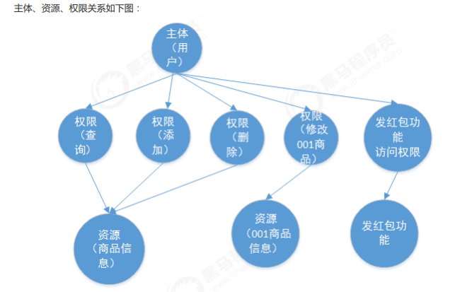
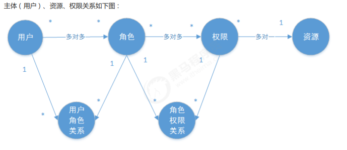
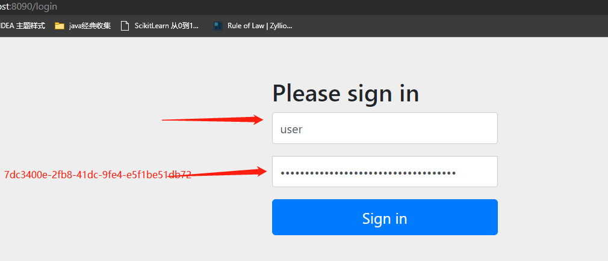
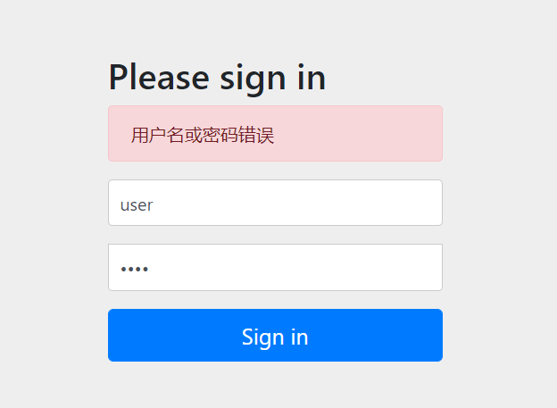
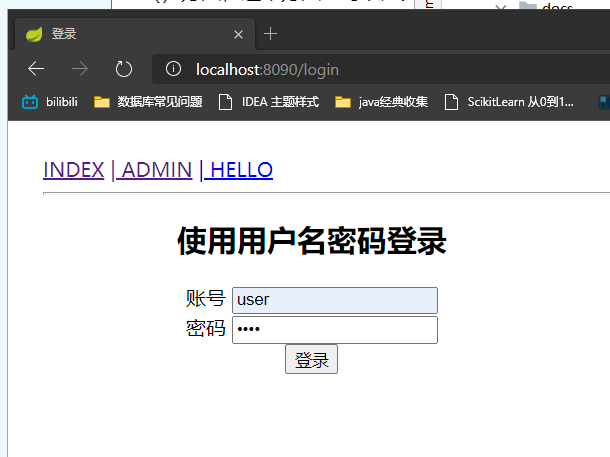
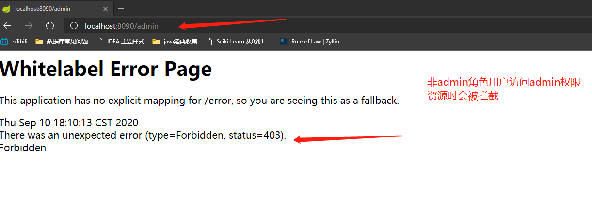

== Spring Security 认证授权
=== 1. 基本概念
==== 1.1 什么是认证
进入移动互联网时代，大家每天都在刷手机，常用的软件有微信、支付宝、头条等，下边拿微信来举例子说明认证相关的基本概念，在初次使用微信前需要注册成为微信用户，然后输入账号和密码即可登录微信，输入账号和密码登录微信的过程就是认证。


===== 系统为什么要认证？

    认证是为了保护系统的隐私数据与资源，用户的身份合法方可访问该系统的资源。
    认证 ：用户认证就是判断一个用户的身份是否合法的过程，用户去访问系统资源时系统要求验证用户的身份信息，身份合法方可继续访问，不合法则拒绝访问。常见的用户身份认证方式有：用户名密码登录，二维码登录，手机短信登录，指纹认证等方式。

==== 1.2 什么是授权

还拿微信来举例子，微信登录成功后用户即可使用微信的功能，比如，发红包、发朋友圈、添加好友等，没有绑定
银行卡的用户是无法发送红包的，绑定银行卡的用户才可以发红包，发红包功能、发朋友圈功能都是微信的资源即
功能资源，用户拥有发红包功能的权限才可以正常使用发送红包功能，拥有发朋友圈功能的权限才可以使用发朋友
圈功能，这个根据用户的权限来控制用户使用资源的过程就是授权。

===== 为什么要授权？

    认证是为了保证用户身份的合法性，授权则是为了更细粒度的对隐私数据进行划分，授权是在认证通过后发生的，控制不同的用户能够访问不同的资源。
授权： 授权是用户认证通过根据用户的权限来控制用户访问资源的过程，拥有资源的访问权限则正常访问，没有权限则拒绝访问。

==== 1.3 授权的数据模型



* 如上图所示用户拥有不同权限来执行不同操作
** 主体（用户id、账号、密码、...）
** 资源（资源id、资源名称、访问地址、...）
** 权限（权限id、权限标识、权限名称、资源id、...）
** 角色（角色id、角色名称、...）



[plantuml,auth-sequence,svg]

==== 1.4 RBAC
业务通常基于RBAC实现授权。

- RBAC基于角色的访问控制（Role-Based Access Control）是按角色进行授权，比如：主体的角色为总经理可以查询员工工资信息，访问控制流程如下：

[plantuml,role_based,svg]
----
@startuml
start
:查询工资;
if (判断主体是否拥有总经理角色) then (是)
    :继续访问;
    stop
else (否)
    :无权访问;
    end
endif
@enduml
----

- 根据上图中的判断逻辑，授权代码可表示如下：

    if(主体.hasRole("总经理角色id")){
        查询工资
    }


- RBAC基于资源的访问控制（Resource-Based Access Control）是按资源（或权限）进行授权，比如：用户必须
具有查询工资权限才可以查询员工工资信息等，访问控制流程如下：

[plantuml,Resource_based,svg]
----
@startuml
start
:查询工资;
if (判断主体是否拥有查询查询工资的权限) then (是)
    :继续访问;
    stop
else (否)
    :无权访问;
    end
endif
@enduml
----

- 根据上图中的判断，授权代码可以表示为：

    if(主体.hasPermission("查询工资权限标识")){
        查询工资
    }


=== 2. Spring Security的使用

==== 2.1  Spring Security介绍

Spring Security是一个能够为基于Spring的企业应用系统提供声明式的安全访问控制解决方案的安全框架。由于它 是Spring生态系统中的一员，因此它伴随着整个Spring生态系统不断修正、升级，在spring boot项目中加入spring security更是十分简单，使用Spring Security 减少了为企业系统安全控制编写大量重复代码的工作。

==== 2.2 工作流程
===== a. 认证流程

[plantuml,Authentication,svg]
.认证流程图
----
@startuml
UsernamePasswordAuthenticationFilter -> UsernamePasswordAuthenticationFilter: 将请求信息封装为Authentication
UsernamePasswordAuthenticationFilter -> AuthenticationManager: 认证authenticate()
AuthenticationManager -> DaoAuthenticationProvider: 委托认证authenticate()
DaoAuthenticationProvider -> UserDetailsService: 获取用户信息
UserDetailsService -> DaoAuthenticationProvider: 返回UserDetails
DaoAuthenticationProvider -> DaoAuthenticationProvider: 通过PasswordEncoder对比UserDetails和Authentication密码
DaoAuthenticationProvider -> DaoAuthenticationProvider: 填充Authentication权限信息
UsernamePasswordAuthenticationFilter -> SecurityContextHolder: 通过SecurityContextHolder将Authentication保存至安全上下文
@enduml
----

* 认证过程细节分析：

**  用户提交用户名、密码被SecurityFilterChain中的 UsernamePasswordAuthenticationFilter 过滤器获取到， 封装为请求Authentication，通
常情况下是UsernamePasswordAuthenticationToken这个实现类。
**  然后过滤器将Authentication提交至认证管理器（AuthenticationManager）进行认证
**  认证成功后， AuthenticationManager 身份管理器返回一个被填充满了信息的（包括上面提到的权限信息， 身份信息，细节信息，但密码通常会被移除）
Authentication 实例。
**  SecurityContextHolder 安全上下文容器将第3步填充了信息的 Authentication ，通过SecurityContextHolder.getContext().setAuthenti
cation(…)方法，设置到其中。可以看出AuthenticationManager接口（认证管理器）是认证相关的核心接口，也是发起认证的出发点，它 的实现类为Provide
rManager。而Spring Security支持多种认证方式，因此ProviderManager维护着一个 List<AuthenticationProvider> 列表，存放多种认证方式，最终
实际的认证工作是由 AuthenticationProvider完成的。咱们知道web表单的对应的AuthenticationProvider实现类为 DaoAuthenticationProvider，
它的内部又维护着一个UserDetailsService负责UserDetails的获取。最终 AuthenticationProvider将UserDetails填充至Authentication。认证核
心组件的大体关系如下：

===== b. 授权流程

[plantuml,authorize,svg]
.授权流程图
----
@startuml

用户 -> FilterSecurityInterceptor: 认证后的用户访问受保护的资源
FilterSecurityInterceptor -> SecurityMetadataSource: 获取访问当前资源所需要的权限：getAttribures()
SecurityMetadataSource -> FilterSecurityInterceptor: 返回Collection<ConfigAttribute>
FilterSecurityInterceptor -> AccessDecisionManger: 授权决策：Decide()
AccessDecisionManger -> AccessDecisionManger: 投票决策
AccessDecisionManger -> FilterSecurityInterceptor: 决策通过
FilterSecurityInterceptor -> FilterSecurityInterceptor: 允许访问资源，请求放行
@enduml
----

* 授权过程细节分析

** 拦截请求，已认证用户访问受保护的web资源将被SecurityFilterChain中的 FilterSecurityInterceptor 的子
类拦截。
** 获取资源访问策略，FilterSecurityInterceptor会从 SecurityMetadataSource 的子类
DefaultFilterInvocationSecurityMetadataSource 获取要访问当前资源所需要的权限
Collection<ConfigAttribute> 。
** 最后，FilterSecurityInterceptor会调用 AccessDecisionManager 进行授权决策，若决策通过，则允许访问资
源，否则将禁止访问。

==== 2.3  Spring Security快速上手
===== a.简单入门
在idea上创建SpringBoot项目，构建时选择使用的组件，如：Spring MVC、Spring Security、Mybatis、thymeleaf、Mysql

pom.xml
```xml
    <dependencies>
        <dependency>
            <groupId>org.springframework.boot</groupId>
            <artifactId>spring-boot-starter-jdbc</artifactId>
        </dependency>
        <dependency>
            <groupId>org.springframework.boot</groupId>
            <artifactId>spring-boot-starter-web</artifactId>
        </dependency>
        <dependency>
            <groupId>org.mybatis.spring.boot</groupId>
            <artifactId>mybatis-spring-boot-starter</artifactId>
            <version>1.3.2</version>
        </dependency>

        <dependency>
            <groupId>org.springframework.boot</groupId>
            <artifactId>spring-boot-starter-security</artifactId>
        </dependency>
        <dependency>
            <groupId>org.springframework.boot</groupId>
            <artifactId>spring-boot-starter-thymeleaf</artifactId>
        </dependency>
        <dependency>
            <groupId>org.thymeleaf.extras</groupId>
            <artifactId>thymeleaf-extras-springsecurity4</artifactId>
        </dependency>

        <!--db-->
        <dependency>
            <groupId>mysql</groupId>
            <artifactId>mysql-connector-java</artifactId>
            <version>6.0.5</version>
        </dependency>
    </dependencies>

```
application.yml
```yml
server:
  port: 8090
spring:
  application:
    name: springsecurity
  datasource:
    url: jdbc:mysql://localhost:3306/user?serverTimezone=UTC&characterEncoding=utf-8&useSSL=false
    driver-class-name: com.mysql.cj.jdbc.Driver
    username: root
    password: root
  thymeleaf:
    prefix: classpath:/public/
    suffix: .html
    mode: HTML5
    encoding: utf-8
    cache: false
mybatis:
  mapper-locations: classpath:mapping/*Mapper.xml
  type-aliases-package: com.wb.security.domian
```

    注意加标签@SpringBootApplication，表示这将是按照 Spring boot 项目的形式运行。然后直接右键运行启动，留意下输出窗口，看看什么情况，启动成功，注意，输出栏的日志里很突兀的大了这样一行代码：Using generated security password: XXXX7e44-e83c-460a-aeef-94249316XXXX ，这个是 Spring Security 自带默认的，用户名为user，密码就是这串UUID一样的串儿，接下来，我们浏览器输入：http://localhost:8090，敲回车，自动跳转到了http://localhost:8090/login的路径，我们可以看到一个框架本身自带的登录页面：



输入错误密码：



好了，初步的 Spring Security 项目验证通过，项目创建完成。

===== b. 自定义认证授权
* 创建数据库user,添加用户、角色、权限资源和他们的关联关系表。
```sql
/*
 Navicat Premium Data Transfer

 Source Server         : wabr
 Source Server Type    : MySQL
 Source Server Version : 50731
 Source Host           : localhost:3306
 Source Schema         : user

 Target Server Type    : MySQL
 Target Server Version : 50731
 File Encoding         : 65001

 Date: 10/09/2020 17:28:28
*/

SET NAMES utf8mb4;
SET FOREIGN_KEY_CHECKS = 0;

-- ----------------------------
-- Table structure for sys_permission
-- ----------------------------
DROP TABLE IF EXISTS `sys_permission`;
CREATE TABLE `sys_permission`  (
  `id` int(10) UNSIGNED NOT NULL AUTO_INCREMENT,
  `name` varchar(255) CHARACTER SET utf8mb4 COLLATE utf8mb4_bin NULL DEFAULT NULL,
  `descritpion` varchar(255) CHARACTER SET utf8mb4 COLLATE utf8mb4_bin NULL DEFAULT NULL,
  `url` varchar(255) CHARACTER SET utf8mb4 COLLATE utf8mb4_bin NULL DEFAULT NULL,
  `pid` int(11) NULL DEFAULT NULL,
  PRIMARY KEY (`id`) USING BTREE
) ENGINE = InnoDB AUTO_INCREMENT = 5 CHARACTER SET = utf8mb4 COLLATE = utf8mb4_bin ROW_FORMAT = Dynamic;

-- ----------------------------
-- Records of sys_permission
-- ----------------------------
INSERT INTO `sys_permission` VALUES (1, 'P_INDEX', 'index页面资源', '/index', NULL);
INSERT INTO `sys_permission` VALUES (2, 'P_ADMIN', 'admin页面资源', '/admin', NULL);
INSERT INTO `sys_permission` VALUES (3, 'P_HELLO', 'hello页面资源', '/home', NULL);
INSERT INTO `sys_permission` VALUES (4, 'P_USER', 'user页面资源', '/user', NULL);

-- ----------------------------
-- Table structure for sys_permission_role
-- ----------------------------
DROP TABLE IF EXISTS `sys_permission_role`;
CREATE TABLE `sys_permission_role`  (
  `id` int(10) UNSIGNED NOT NULL AUTO_INCREMENT,
  `role_id` int(11) NULL DEFAULT NULL,
  `permission_id` int(11) NULL DEFAULT NULL,
  PRIMARY KEY (`id`) USING BTREE
) ENGINE = InnoDB AUTO_INCREMENT = 11 CHARACTER SET = utf8mb4 COLLATE = utf8mb4_bin ROW_FORMAT = Dynamic;

-- ----------------------------
-- Records of sys_permission_role
-- ----------------------------
INSERT INTO `sys_permission_role` VALUES (1, 1, 1);
INSERT INTO `sys_permission_role` VALUES (2, 1, 2);
INSERT INTO `sys_permission_role` VALUES (3, 2, 1);
INSERT INTO `sys_permission_role` VALUES (4, 3, 1);
INSERT INTO `sys_permission_role` VALUES (6, 3, 3);
INSERT INTO `sys_permission_role` VALUES (7, 3, 4);
INSERT INTO `sys_permission_role` VALUES (8, 2, 4);
INSERT INTO `sys_permission_role` VALUES (9, 1, 3);
INSERT INTO `sys_permission_role` VALUES (10, 1, 4);

-- ----------------------------
-- Table structure for sys_role
-- ----------------------------
DROP TABLE IF EXISTS `sys_role`;
CREATE TABLE `sys_role`  (
  `id` int(10) UNSIGNED NOT NULL AUTO_INCREMENT,
  `name` varchar(255) CHARACTER SET utf8mb4 COLLATE utf8mb4_bin NULL DEFAULT NULL,
  PRIMARY KEY (`id`) USING BTREE
) ENGINE = InnoDB AUTO_INCREMENT = 4 CHARACTER SET = utf8mb4 COLLATE = utf8mb4_bin ROW_FORMAT = Dynamic;

-- ----------------------------
-- Records of sys_role
-- ----------------------------
INSERT INTO `sys_role` VALUES (1, 'ROLE_ADMIN');
INSERT INTO `sys_role` VALUES (2, 'ROLE_USER');
INSERT INTO `sys_role` VALUES (3, 'ROLE_ROOT');

-- ----------------------------
-- Table structure for sys_role_user
-- ----------------------------
DROP TABLE IF EXISTS `sys_role_user`;
CREATE TABLE `sys_role_user`  (
  `id` int(10) UNSIGNED NOT NULL AUTO_INCREMENT,
  `sys_user_id` int(11) NULL DEFAULT NULL,
  `sys_role_id` int(11) NULL DEFAULT NULL,
  PRIMARY KEY (`id`) USING BTREE
) ENGINE = InnoDB AUTO_INCREMENT = 5 CHARACTER SET = utf8mb4 COLLATE = utf8mb4_bin ROW_FORMAT = Dynamic;

-- ----------------------------
-- Records of sys_role_user
-- ----------------------------
INSERT INTO `sys_role_user` VALUES (1, 1, 1);
INSERT INTO `sys_role_user` VALUES (2, 2, 2);
INSERT INTO `sys_role_user` VALUES (3, 3, 3);
INSERT INTO `sys_role_user` VALUES (4, 4, 2);

-- ----------------------------
-- Table structure for sys_user
-- ----------------------------
DROP TABLE IF EXISTS `sys_user`;
CREATE TABLE `sys_user`  (
  `id` int(10) UNSIGNED NOT NULL AUTO_INCREMENT,
  `username` varchar(255) CHARACTER SET utf8mb4 COLLATE utf8mb4_bin NULL DEFAULT NULL,
  `password` varchar(255) CHARACTER SET utf8mb4 COLLATE utf8mb4_bin NULL DEFAULT NULL,
  PRIMARY KEY (`id`) USING BTREE
) ENGINE = InnoDB AUTO_INCREMENT = 5 CHARACTER SET = utf8mb4 COLLATE = utf8mb4_bin ROW_FORMAT = Dynamic;

-- ----------------------------
-- Records of sys_user
-- ----------------------------
INSERT INTO `sys_user` VALUES (1, 'admin', 'admin');
INSERT INTO `sys_user` VALUES (2, 'user', 'user');
INSERT INTO `sys_user` VALUES (3, 'wangbin', 'wangbin');
INSERT INTO `sys_user` VALUES (4, 'xiaoliu', 'xiaoliu');

SET FOREIGN_KEY_CHECKS = 1;

```

* 添加相关静态页面(login、index、admin、hello.html)

* 项目entity层、dao数据持久层，由于篇幅有限以上内容均不做列举 #可参考尾部项目源码#

* SecurityDataService.java  提供用户相关的角色和权限
```java
/**
 * Security 数据服务
 */
@Component
public class SecurityDataService {
    @Autowired
    private UserMapper userMapper;
    @Autowired
    private PermissionMapper permissionMapper;
    @Autowired
    private SysRoleDao sysRoleDao;

    public SysUser findSUserByName(String name) {
        return userMapper.findByUserName(name);
    }

    public List<SysRole> findSRoleListBySUserId(int UserId) {
        return sysRoleDao.findSRoleListBySUserId(UserId);
    }

    public List<SysRole> findSRoleListBySPermissionUrl(String sPermissionUrl) {
        return sysRoleDao.findSRoleListBySPermissionUrl(sPermissionUrl);
    }
    public List<Permission> findSPermissionListBySUserId(int UserId) {
        return permissionMapper.findByUserId(UserId);
    }

    public List<Permission> findSPermissionListBySPermissionUrl(String sPermissionUrl) {
        return permissionMapper.findByUrl(sPermissionUrl);
    }
}
```

* *重点*：Spring Security用户认证

    首先回顾一下，Spring Security 认证有关的重要类或接口:UserDetails、UserDetailsService、AuthenticationProvider，我们将尝试自定义封装UserDetails，经由UserDetailsService提供给AuthenticationProvider，然后和请求消息中获取的用户信息进行对比认证。

VUserDetails.java  用户信息的封装，包含用户名称密码及用户状态、权限等信息
```java
//核心代码
/**
     * 获取用户权限列表方法
     * 可以理解成，返回了一个List<String>，之后所谓的权限控制、鉴权，其实就是跟这个list里的String进行对比
     * 这里处理了角色和资源权限两个列表，可以这么理解，
     * 角色是权限的抽象集合，是为了更方便的控制和分配权限，而真正颗粒化细节方面，还是需要资源权限自己来做
     */
    @Override
    public Collection<? extends GrantedAuthority> getAuthorities() {
        StringBuilder authoritiesBuilder = new StringBuilder("");
        //拿到权限类
        List<SysRole> tempRoleList = this.getSysRoleList();
        if (null != tempRoleList){
            for (SysRole sysRole : tempRoleList){
                //获得角色列表
                authoritiesBuilder.append(",").append(sysRole.getName());
            }
        }
        List<Permission> tempPermissionList = this.getsPermissionList();
        if (null!=tempPermissionList) {
            for (Permission permission : tempPermissionList) {
                //获得用户权限
                authoritiesBuilder.append(",").append(permission.getName());
            }
        }
        String authoritiesStr = "";
        if (authoritiesBuilder.length()>0){
            authoritiesStr = authoritiesBuilder.deleteCharAt(0).toString();
        }
        logger.info("VUserDetails getAuthorities [authoritiesStr={} ", authoritiesStr);

        return AuthorityUtils.commaSeparatedStringToAuthorityList(authoritiesStr);
    }
```

* VUserDetailsService.java 提供用户信息封装服务

```java
@Component
public class VUserDetailsService implements UserDetailsService {
    @Autowired
    SecurityDataService securityDataService;

    /**
     * 根据用户输入的用户名返回数据源中用户信息的封装，返回一个UserDetails
     */
    @Override
    public UserDetails loadUserByUsername(String username) throws UsernameNotFoundException {
        //查询用户是否存在
        SysUser sUser = securityDataService.findSUserByName(username);
        //todo 用户不存在会报错，待解决
        //查询用户角色列表
        List<SysRole> sRoleList = securityDataService.findSRoleListBySUserId(sUser.getId());
        //查询用户资源权限列表
        List<Permission> sPermissionList = securityDataService.findSPermissionListBySUserId(sUser.getId());
        return new VUserDetails(sUser,sRoleList,sPermissionList);
    }

}
```

* VAuthenticationProvider.java 认证提供者，校验用户，登录名密码，以及向系统提供一个用户信息的综合封装
```java
 /**
     * 首先，在用户登录的时候，系统将用户输入的的用户名和密码封装成一个Authentication对象
     * 然后，根据用户名去数据源中查找用户的数据，这个数据是封装成的VUserDetails对象
     * 接着，将两个对象进行信息比对，如果密码正确，通过校验认证
     * 最后，将用户信息（含身份信息、细节信息、密码、权限等）封装成一个对象，此处参考UsernamePasswordAuthenticationToken
     * 最最后，会将这个对象交给系统SecurityContextHolder中（功能类似Session），以便后期随时取用
     */
    @Override
    public Authentication authenticate(Authentication authentication)  {
        //获取authenticate用户名和密码
        String username = authentication.getName();
        String password = authentication.getCredentials().toString();
        logger.info("VAuthenticationProvider authenticate login user [username={}, password={}]", username, password);
        VUserDetails userDetails =(VUserDetails)vUserDetailsService.loadUserByUsername(username);
        //todo gson转换问题
       // logger.info("VAuthenticationProvider authenticate vUserDetails [vUserDetails={}]", gson.toJson(userDetails));
        if (userDetails == null){
            throw new BadCredentialsException("用户没有找到");
        }
        if (!password.equals(userDetails.getPassword())) {
            logger.info("VAuthenticationProvider authenticate BadCredentialsException [inputPassword={}, DBPassword={}]", password, userDetails.getPassword());
            throw new BadCredentialsException("密码错误");
        }
        //校验成功通过后，封装UsernamePasswordAuthenticationToken返回
        return new UsernamePasswordAuthenticationToken(userDetails,password,userDetails.getAuthorities());
    }
```

WebMvcConfig.java 访问路径配置类
```java
//可以理解成做简单访问过滤的，转发到相应的视图页面
@Configuration
public class WebMvcConfig implements WebMvcConfigurer {
    @Override
    public void addViewControllers(ViewControllerRegistry registry) {
        registry.addViewController("/login").setViewName("login");
        registry.addViewController("/").setViewName("index");
        registry.addViewController("/index").setViewName("index");
    }
}
```

WebSecurityConfig.java 主配置文件
```@Configuration
@EnableWebSecurity
@EnableGlobalMethodSecurity(prePostEnabled = true)
public class WebSecurityConfig extends WebSecurityConfigurerAdapter {
    @Override
    protected void configure(HttpSecurity http) throws Exception {

        http
                .authorizeRequests()
                //静态资源过滤
                .antMatchers("/css/**", "/js/**", "/images/**", "/webjars/**", "**/favicon.ico").permitAll()
                //ROLE_USER的权限才能访问的资源
                .antMatchers("/user/**").permitAll()
                .anyRequest().authenticated()
                .and()
                .formLogin()
                //指定登录页面，授予所有用户访问登录界面
                .loginPage("/login")
                //设置默认登录成功后跳转页面，错误回到login界面
                .defaultSuccessUrl("/index").permitAll()
                .failureUrl("/login?error").permitAll()
                .and()
                // 定义登出操作
                .logout().logoutSuccessUrl("/login?logout").permitAll()
                .and()
                .csrf().disable()
        ;
        //禁用缓存
        http.headers().cacheControl();
    }

    /**
     * 开启注解控制权限
     * 见Controller 中 @PreAuthorize("hasAuthority('XXX')")
     */
    @Bean
    @Override
    public AuthenticationManager authenticationManagerBean() throws Exception {
        return super.authenticationManagerBean();
    }

}
```

现在就可以用自定义用户来访问了


* *重点*：Spring Security之鉴权

```java
    @PreAuthorize("hasAuthority('R_ADMIN')")
    @RequestMapping("/admin")
    public String admin(Model model, String tt) {
        return "admin";
    }
```
* *重点*：Spring Security之鉴权-过滤器

VFilterInvocationSecurityMetadataSource.java 根据用户请求的地址，获取访问该地址需要的所需权限
```java
 @Override
    public Collection<ConfigAttribute> getAttributes(Object object) throws IllegalArgumentException {
        //获取请求起源路径
        String requestUrl = ((FilterInvocation) object).getRequestUrl();
        logger.info("VFilterInvocationSecurityMetadataSource getAttributes [requestUrl={}]", requestUrl);
        //登录页面就不需要权限
        if ("/login".equals(requestUrl)){
            return null;
        }
        //用来存储访问路径需要的角色或权限信息
        List<String> tempPermissionList = new ArrayList();
        //获取角色列表
        List<SysRole> sRoleList = securityDataService.findSRoleListBySPermissionUrl(requestUrl);
        //logger.info("VFilterInvocationSecurityMetadataSource getAttributes [sRoleList={}]", gson.toJson(sRoleList));
        for (SysRole sysRole : sRoleList) {
            tempPermissionList.add(sysRole.getName());
        }
        //获取资源路径权限列表
        List<Permission> sPermission = securityDataService.findSPermissionListBySPermissionUrl(requestUrl);
        for (Permission permission : sPermission) {
            tempPermissionList.add(permission.getName());
        }
        //如果没有权限控制的url,可以设置都可以访问,也可以设置为不许访问
        if (tempPermissionList.isEmpty()){
            return null;
            //tempPermissionList.add("DEFAULT_FORBIDDEN");//默认禁止
        }
        String[] permissionArray = tempPermissionList.toArray(new String[0]);
        logger.info("VFilterInvocationSecurityMetadataSource getAttributes [permissionArray={}]", gson.toJson(permissionArray));
        return SecurityConfig.createList(permissionArray);
    }
```

VAccessDecisionManager.java 校验用户是否有权限访问请求资源
```java
@Override
    public void decide(Authentication authentication, Object bj, Collection<ConfigAttribute> collection) throws AccessDeniedException, InsufficientAuthenticationException {
        //当前用户所具有的权限
        Collection<? extends GrantedAuthority> userAuthorities = authentication.getAuthorities();
        //访问资源所需要的权限信息
        Collection<ConfigAttribute> needAuthoritieList = collection;
        //依次循环对比，发现有问题即返回
        for (ConfigAttribute configAttribute : needAuthoritieList) {
            String needattribute = configAttribute.getAttribute();
            for (GrantedAuthority userAuthority : userAuthorities) {
                String authority = userAuthority.getAuthority();
                if (needattribute.equals(authority)){
                    return;
                }
            }
        }

        //执行到这里说明没有匹配到权限
        throw new AccessDeniedException("权限不足！");
    }
```

*最后，要写一个过滤器，提供上边这些功能的工作场所，创建 VFilterSecurityInterceptor 类，继承 AbstractSecurityInterceptor 并实现 Filter，这就是个鉴权过滤器，代码如下:*
```java
   @Override
    public void doFilter(ServletRequest request, ServletResponse response, FilterChain chain)
            throws IOException, ServletException {
        FilterInvocation filterInvocation = new FilterInvocation(request, response, chain);
        invoke(filterInvocation);
    }

    public void invoke(FilterInvocation filterInvocation) throws IOException,ServletException{
        // filterInvocation里面有一个被拦截的url
        // 里面调用VFilterInvocationSecurityMetadataSource的getAttributes(Object object)这个方法获取filterInvocation对应的所有权限
        // 再调用VAccessDecisionManager的decide方法来校验用户的权限是否足够
        InterceptorStatusToken interceptorStatusToken = super.beforeInvocation(filterInvocation);
        try{
            // 执行下一个拦截器
            filterInvocation.getChain().doFilter(filterInvocation.getRequest(), filterInvocation.getResponse());
        }finally {
            super.afterInvocation(interceptorStatusToken,null);
        }
    }
```
